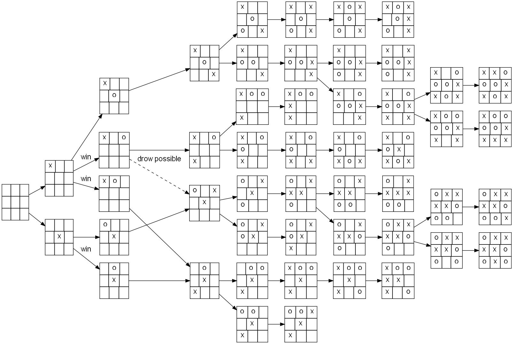
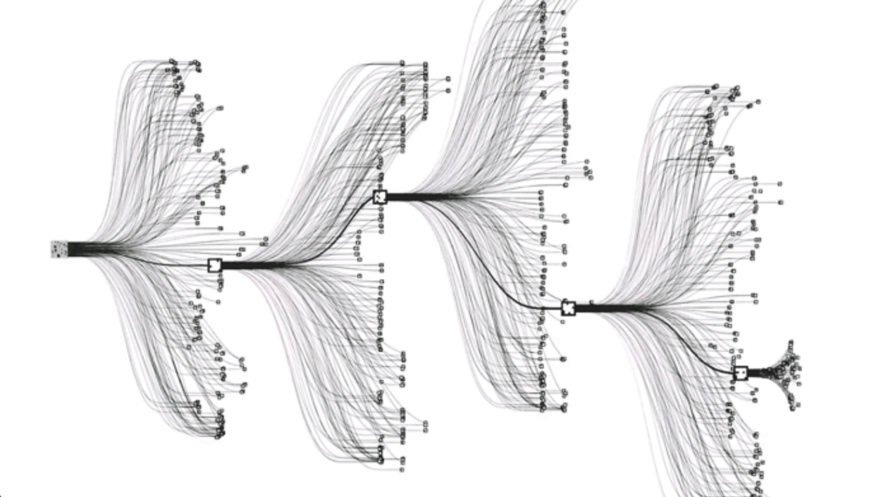

## [`$\alpha_0$`] t0 3l0


_"For a true AI isn't measured by the size of its tree, but by the precision of its moves." Filottete_ 


## Outline

0. The math behind Go 
1. From Crazy Stone -> AlphaGO
2. AlphaGo vs AlphaZero
3. Policy Iteration
4. Policy Improvement (Math alert!)
5. Policy Evaluation
6. Code and demo


Note:
- Each player put a stone on the goban (19 x 19), black first
- A stone can be captured if sorrounded from two stones
- The winner is the one who conquer the larger region


* <!-- .element: class="fragment" -->`$10^{170}$` possible states
* <!-- .element: class="fragment" -->`$10^{360}$` possible games for each starting state
* 250 legal moves from each state<!-- .element: class="fragment" -->
* 150 moves for each match <!-- .element: class="fragment" -->

Note:
- state_space complexity 10^170 (estimated numer of possible board config)
- search complexity in time 10^360 (the number of games that can be played for each starting state)
- branch ~ 250 av of legal moves
- depth ~ 150 av. lenght of the game








## AI in Go


_"The mystery of Go, the ancient game that computers still can't win" - Wired 2014_


* Go is constructive<!-- .element: class="fragment" -->
* Difficult to build an evaluation functional<!-- .element: class="fragment" -->
* Humans describe more as intuititive game<!-- .element: class="fragment" -->

Note:
- Go is constructive instead of destructive
- Go is hard because is difficult to build an evaluation function of each board position
thus alpha-beta search doesn't work.
- Even humans describe as intuition


* Adversarial<!-- .element: class="fragment" -->
* Deterministic<!-- .element: class="fragment" -->
* Fully observable<!-- .element: class="fragment" -->

Note:
- MCTS with deep neural network works very well because of the averaging of the errors, while alpha_beta search propagates the largest approximation error up in the tree.


### CrazyStone


Note:
- The first to use UCT
- Three pruning and local pattern recognition
- Achived 6 dan in 2014 at the time of the wired article


Note:
TODO!
- First to use Neural networks
- Value network and Polcy network pretrained from high quality data
- It has been trained for a month on 36 GPUs


### AlphaGo Zero vs AlphaZero

- No data augmentation
- No threshold update
- Diff. exploration noise for each game

Note:
- Exploit simmetries in board position as rotation and reflection
- Value function optimize the expected outcome and not the probability of winning
- No update threshold update
- Exploration Noise from a dirchlet.
for which if alpha -> 0 the area under the curve becomes conconcetrade, while alpha -> it flattens out, ensuring a larger exploration. Is like a multivariate of the beta (in go we have the smallest noise, while in chess the largest) 
The reason for this could actually be the fact that the local shift of board position is small in go, and could be very large in chess.


Note:
- if we search in the appropriate way we don't need "prior knowledge" embedded in the method, but in the architecture


## Reinforcement Learning


Note:
- The basic idea of reinforcement learning is given an environment the agent can interact in a sequential way. For each step, it take an action and observe a next step, and a reward of this action.


`$v_\pi(s) = E_{\pi}\left[\sum_t \gamma^t R_t \mid S_t\right] $`<!-- .element: class="fragment" -->

where:

`$\pi(a\mid s) = P(a \mid s) \ \ \forall s \in S$`<!-- .element: class="fragment" -->

Note:
- Let pi be a probability distribution of chosing a specific action given a state
- The goal of the agent is to find a way to maximize the the cumulative reward
- Which can be expressed as V, which play the role of the evaluation function
- Notice this expectation depends both on the policy and on the transition dynamics of the env


## Policy Iteration


```python
 - Add sudo code policy iterat
 TODO: paste train(saples)
```

Note:
  - the question now become, how can we find a good policy? 
  - intuitively, if the agent is able to get to a state for which its value is higher than otherwise, we can be sure that the new policy is better at least in one point than the previous one.   
  - we can then evaluate the new policy using the policy evaluation (prediction) step, and repeat until convergence
  - Notice that the key points that manages learning are a good capability of the value function and a reasonable way to choose some actions taht are better than the previous one. We now focus ont he policy improvement phase
  - Notice also that in the policy improvement we have two competing forces and cooperative forces:
    1. making the policy greedy wrt the current value function, will makes the value function incorrect because ...?
    2. and updating the value function makes the policy no longer better (greedy)


### Policy Improvement


1. Plan in the future<!-- .element: class="fragment" -->
2. Try new actions<!-- .element: class="fragment" -->


### Monte-Carlo Tree Search
 


MCTS is an algorithm to perform sampling based lookahead search.


```python

 - Add sudo code MCTS
```

Note:
- given a simulator, which we have, we can build a tree in selective manner starting from a root state and proceding forward.


Note:
  - Select a state from the simulator
  - Expansion and Evaluate (notice that while usually we have a random policy that continues the rollout, here we have a neural network which taka transformation of the state and output a value of the leaf node) (why this actually make any fucking sense?)
  - Backup


With the backup operation we keep track of:

* N(s,a) visit count
* W(s,a) total action value
* Q(s,a) mean action value
* P(s,a) prior probability

Note:
Ok we got a "good way to explore the state space, but how do we select exlporatory action?


### Exploration


* <!-- .element: class="fragment" --> `$\epsilon-greedy$` 
* Bandits <!-- .element: class="fragment" -->

Note:
- eps-greedy could work but we want something that instead of trying action at random, slect action to explore in a "meanigful" way as for example according to their potential of being "good actions"
- This idea is captured in the UCB1, by shifting the current estimate, of this positive factor which tells what is the upper bound of the current estimate of the q value.


`$ c P(s,a) \frac{\sqrt{\sum_b N(s,b) }}{1 + N(s,a)}  $`<!-- .element: class="fragment" -->

Note:
- Notice this upper bound is made of 3 components:
  - c constant det the level of exploration
  - P(s,a) which is the joint prio probability of being in such a "context"
  - This ration is the proportion of times i choose a diff. action / time i picked that action
- This control strategy will prefer action with higher prior probability


### Policy Evaluation playing against yourself


### Self play - why?

How can you understand how well you are doing?
Note:
we can't have humans in the loop, that's slow
we can't have other robots, that's what we want to achieve


### Self play - what is it?
* Clone yourself and fight!
* As the Yous battle, observe the fight
* Use those experiences to improve further
Note:
easy, clone yoruself
observe the fight
learn from that


### Self play - how is it used in AlphaZero?
```python
   board_snapshot = game.reset()
   while not terminal:
     action = player_mcts.pick_move(board_snapshot)
     board_snapshot, reward, terminal, opponent_action = game.step(action)
     training_samples.append((b, current_player_id, action))
     training_samples.append((b, opponent_player_id, opponent_action))
     
   training_samples = []
   for board, action, player_id, reward in training_samples:
       subjective_reward = 1 if player_id == game.winner_id else -1
       training_samples.append((board, action, subjective_reward))
   return training_samples
```


### Self play - as seen on?
* soccer
  * goal keeper
* multi agent games
  * other agents gathering food


### Self play - as seen on?
<gif di sumo/>


### The deeper side of RL


### Deep Learning - abstract features

Steal from: https://www.kdnuggets.com/wp-content/uploads/deep-learning.png
* In general Deep Learning is a tool to go from raw data to abstact features
* In AlphaZero we want to ~~classify cats~~ find the best moves.
* More specifically the best move (pi(s)) and how well we are doing (v(s))
Note:
DL goes from pixels to edges to face detectors
how to abstract game board to better play the game


### Deep Learning - where are the layers? 1/523


### Deep Learning - where are the layers? 2/523


### it's-going-to-take-a-while/523


### lol joking/523


### what's a residual?


### value head


### policy head


### Loss function - what makes the model happy?
* (v(s) - v) - pi1(s)*log(pi2(s)) + c * ||theta||
* be more right about 
* do more of the good moves
* do less of the bad moves
* do not change too fast

### To the code!
main:
https://gist.github.com/manuel-delverme/36f9fd220989903274c4badf83c0f880
train:
https://gist.github.com/manuel-delverme/a1b6b93bd5b4d607920b045b039fcb98

### Q&A


### Thank you!


[github/mosc](https://github.com/d3sm0/zelo)
