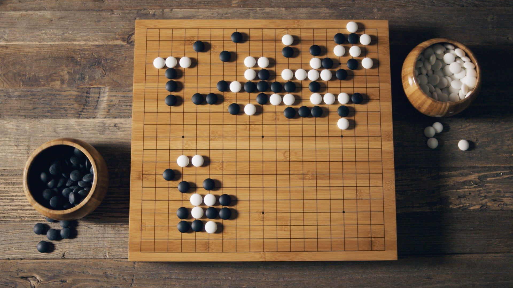
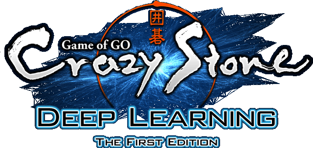
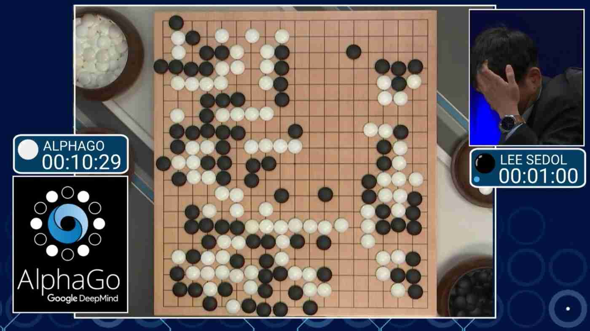
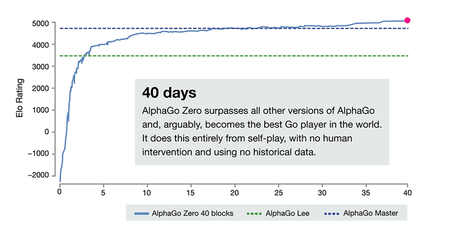
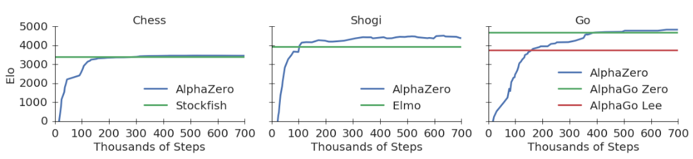
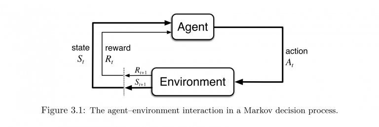
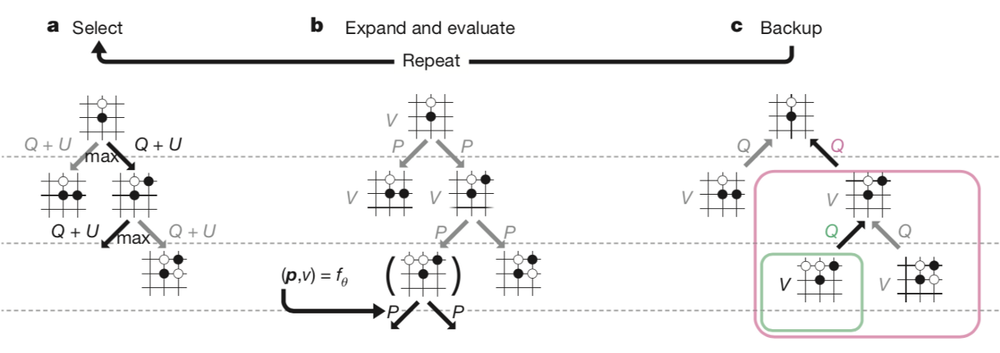

## [`$\alpha_0$`] t0 3l0

Note:
- Introduction
  - we are student in sapienza and "researchers" in Reinforcemnet learning
  - Just to get an idea how many of you have heard about reinforcement learning? OK I see, the presentation may be a bit tecnical at some point, so if you feel something is not clear, feel free to ask questions at the end of the talk or right after, we will be happy to talk with you. Ready?
Every presentation should start with a random quote, and here one that comesfrom one of th greatest trainer of all the time


## Outline

0. The math behind Go 
1. From Crazy Stone -> AlphaGO
2. AlphaGo vs AlphaZero
3. Policy Iteration
4. Policy Improvement (Math alert!)
5. Policy Evaluation
6. The deep side of AlphaZero
7. Code and demo


_"For a true AI isn't measured by the size of its tree, but by the precision of its moves." Filottete_ 




Note:
- Each player put a stone on the goban (19 x 19), black first
- A stone can be captured if sorrounded from two stones
- The winner is the one who conquer the larger region


* Go is constructive <!-- .element: class="fragment" -->
* Humans describe more as intuititive game<!-- .element: class="fragment" -->
* <!-- .element: class="fragment" -->`$10^{170}$` possible states
* <!-- .element: class="fragment" -->`$10^{360}$` possible games for each starting state
Note:
From human perspective go is a costructive game, while chess is destructive, and it's easy to build a strategy. While GO is intuitive. Those two features makes very hard to build an evaluatian funtionl


* Adversarial<!-- .element: class="fragment" -->
* Fully observable<!-- .element: class="fragment" -->
* Deterministic<!-- .element: class="fragment" -->
Note:
From a research perpsective instead we call the environment...
- Deterministic means that we can see that with certainity the stone is on the goban.
- Fully observable that is that each snapshot of the goban, allow us to plan what do next.


## AI in Go


_"The mystery of Go, the ancient game that computers still can't win" - Wired 2014_


### CrazyStone



Note:
- The first mcts to use UCT
- Local pattern recognition to find go local pattern
- Something that (spoiler) today we do with DL
- Achived 6 dan in 2014 at the time of the wired article


Note:
- 15 march 2016 alpha go came along
- Use deep neural nets for valuea nd policy
- It supervised pre train from 30 milion of position from KGS
- and adjusted with self-play




Note:
- 4-1 15 march 2016
- alpha go has elo 1.5x the strenght of crazy stone and at 5/9 of proffessioanal human.
- 40 threads, 48 CPUs, 8 GPUs for several months




Note:
- No pre training
- Single huge neural network for both policy and value
- 4 TPU 72h to beat alpha Go


### AlphaGo Zero vs AlphaZero



Note:
- Destroy stockfish in 100 games, 28 win and 72 draws
- Beat alpha go zero 60/40 
- if we search in the appropriate way we don't need "prior knowledge" embedded in the method, but in the architecture


## Reinforcement Learning




Note:
- The basic idea of reinforcement learning is given an environment the agent can interact in a sequential way. For each step, it take an action and observe a next step, and a reward of this action.


## Example


Note:
- suppose i don't have access to the internet, what would you do? well you go out and ask people nearby
- the more you ask the more you get inforamtion about where the icecream place is


Note:
- you keep walking around until you see find him...super happy with his icecream, and then..there you go...the holigrail


## Notice


* The agent defines the part of the world that wants to explore<!-- .element: class="fragment" -->
* And it evaluates the goodness of its behaviors, based on how much reward is getting<!-- .element: class="fragment" -->

Note:
* The agent defines the part of the world that wants to explore
* And it evaluates the goodness of its behaviors, based on how much reward is getting


`$\pi(a\mid s) = P(a \mid s) \ \ \forall s \in S$`<!-- .element: class="fragment" -->

and:

`$v_\pi(s) = E_{\pi}\left[\sum_t \gamma^t R_t \mid S_t\right] $`<!-- .element: class="fragment" -->

Note:
- Notice this expectation depends both on the policy and on the transition dynamics of the env


```python 
def value(state):
  """
  Black magic
  """
  return v
```

Note:
- In a more pythonic way, we have a function that given the state of the environemnt it tells us how good it is


```python
def policy(state):
  """
  White magic
  """
  return reasonable_actions
```
Note:
- and given state we get all meaninigful actions that we can take, for example left right up or down and so on
- Both of them are neural network but it can be any kind of mapping

## Policy Iteration


```python
 - Add sudo code policy iterat
```

Note:
  - the question now become, how can we find a good policy? 
  - Intuitveley:
    - for each possible future, try a move which would made you win! (Policy improvement)
    - Once you find it, play it and see how good you got (Policy evaluation)


### Policy Improvement


1. Plan in the future<!-- .element: class="fragment" -->
2. Try new actions<!-- .element: class="fragment" -->


### Monte-Carlo Tree Search
 


MCTS is an algorithm to perform sampling based lookahead search.




Note:
  - Given  a policy, could be random
  - Select a state from the simulator
  - Start the simulation until the a terminal conditon is reached
  - Once you finished, backup the values of each node in the tree


With the backup operation we keep track of:

* N(s,a) visit count
* Q(s,a) mean action value

Note:
Ok we got a "good way to explore the state space, but how do we select exlporatory action?


### Exploration


* <!-- .element: class="fragment" --> `$\epsilon-greedy$` 
* Bandits <!-- .element: class="fragment" -->

Note:
- eps-greedy could work but we want something that instead of trying action at random,
- select action that have good potential
  - i.e. actions for which my current value estimate is uncertain


`$ Q(s,a) + c P(s,a) \frac{\sqrt{\sum_b N(s,b) }}{1 + N(s,a)}  $`<!-- .element: class="fragment" -->

Note:
- Notice this upper bound is made of 3 components:
  - c constant det the level of exploration
  - P(s,a) which is the joint prio probability of being in such a "context"
  - This ration is the proportion of times i choose a diff. action / time i picked that action
- This control strategy will prefer action with higher prior probability


### Policy Evaluation


### Training


### Architecture


### Demo


### Q&A


### Thank you!


[github/mosc](https://github.com/d3sm0/zelo)
